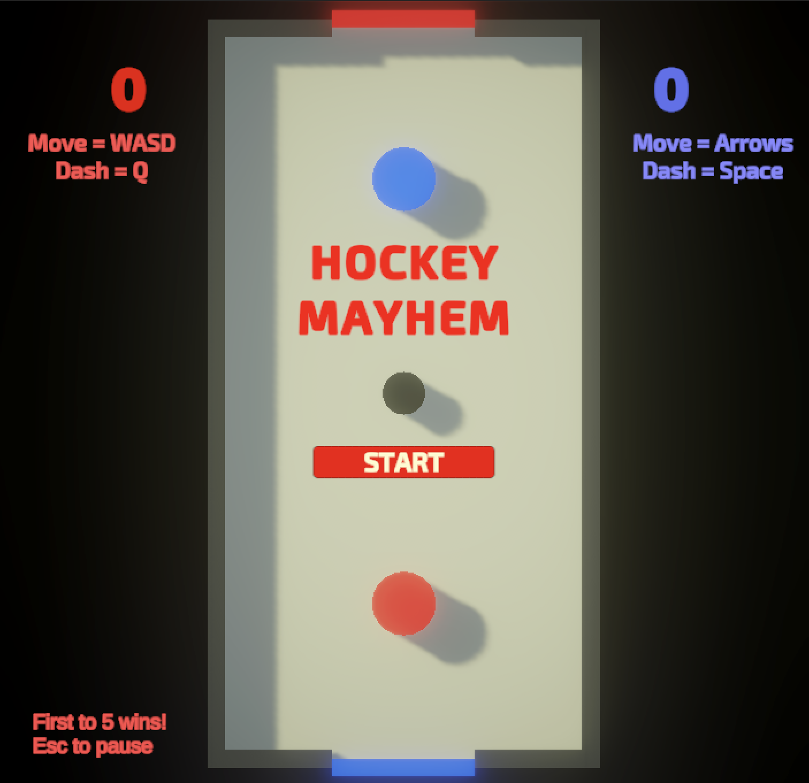

# Hockey Mayhem

A fast-paced, local two-player air hockey game built in Unity. This project was developed as a comprehensive mini-game featuring a full gameplay loop and a focus on satisfying audio-visual feedback.

---

## Features

-   **Local Two-Player Gameplay:** Red player uses WASD + Tab and Blue player uses the Arrow Keys + Space.
-   **Complete Game Loop:** Full cycle from a title screen, to gameplay, to a win screen with a "Play Again" option.
-   **Dash Mechanic:** Both players have a dash ability with a cooldown, complete with sound, particle effects, and a squash-and-stretch animation.
-   **Rich Audio-Visual Feedback:**
    -   **Sound Design:** Unique sounds for puck hits, goals, dashing, UI clicks, and game over.
    -   **VFX:** Custom effects for puck collisions, goal scores, and player dashes.
-   **Robust UI System:** Includes a title screen, dynamic score display with animations, a pause menu, and a game-over screen.

## How to Play

The goal is to be the first player to score 5 points!

| Control | Red | Blue |
| :--- | :--- | :--- |
| **Move** | `WASD` Keys | `Arrow` Keys |
| **Dash** | `Tab` | `Space` |
| **Pause** | `Escape` Key | `Escape` Key |

## Built With

-   **Game Engine:** [Unity](https://unity.com/) (2022.3 LTS or later recommended)
-   **Render Pipeline:** [Universal Render Pipeline (URP)](https://docs.unity3d.com/Packages/com.unity.render-pipelines.universal@latest)

---